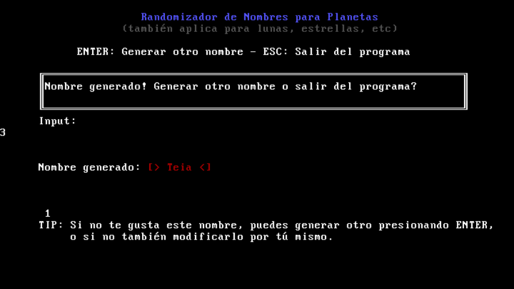

# Name Randomizer for Planets

This is an "astronomical" style name generator with menu that i made for MS-DOS in Turbo Pascal.
You can use this program to give your fictional planets, moons, stars, or whatever, a name!

## Features
* Lets you input how much syllables you want the name to have
* Option to give the name an ending or not (example: "us", "ion", etc)
* Cool menu with colors
* Gives the generated names personality by giving them random colors automatically
* 100 syllables for more variability + 10 endings
* Includes language selector (American english and Rioplatensian spanish avaliable)

## Screenshots
Here's a screenshot of the program running (in spanish), and generating a very familiar name...

---
***For more information, you can extract the files from the .IMG file and view README.TXT.***
